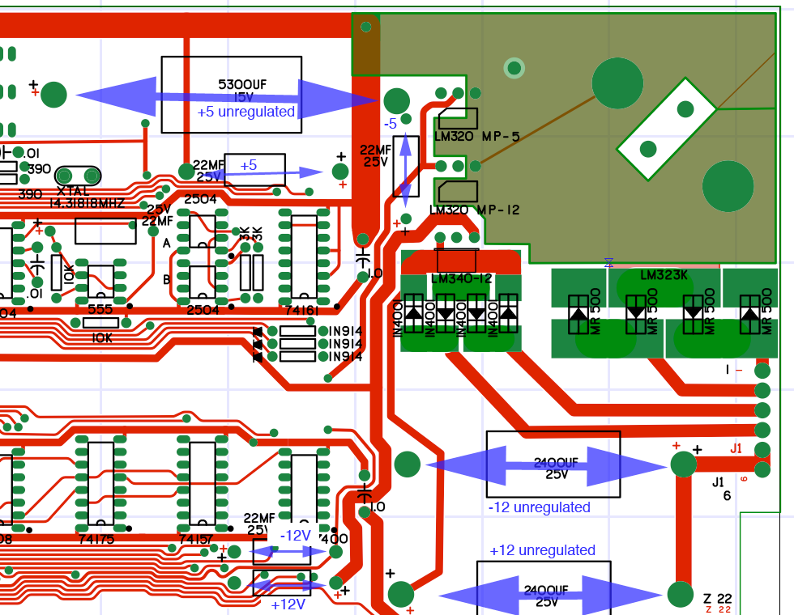
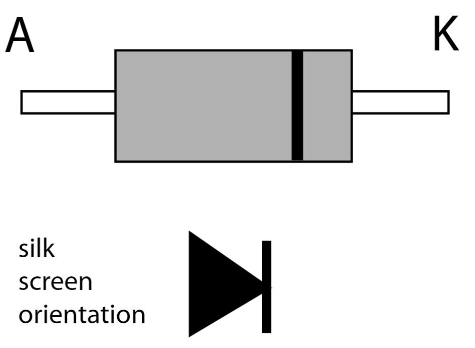
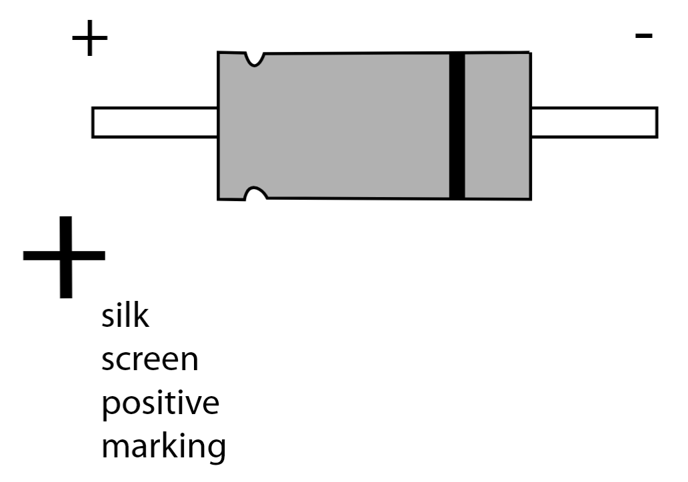
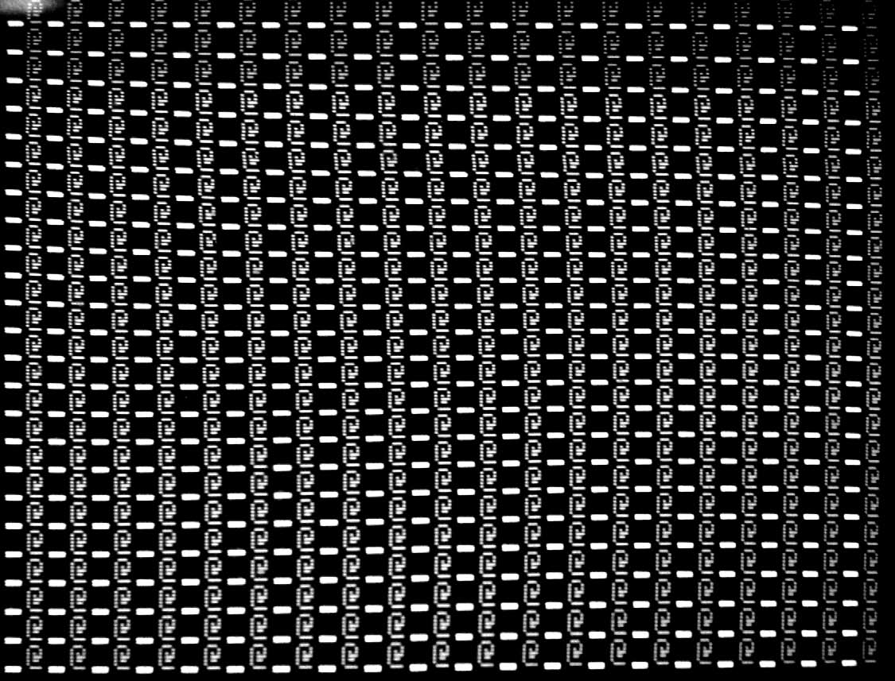
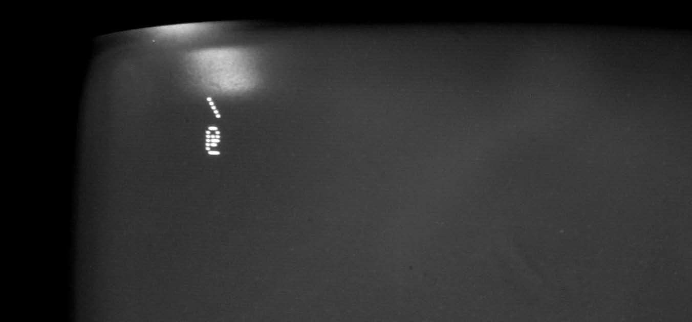

# Apple 1 Clone Computer Assembly and Startup Guide

By Mike Willegal (www.willegal.net)

Compiled from revision 1.1

with Remarks from "Uncle Bernie"

Reformatted in Markdown and Edited for general projects by jgw4

## Preface

This document in large part was written long before me by Mike Willegal, and most of the instructions in this document are his and his alone. My contributions to this document include the addition of installation tips that are also not of my origination. Mostly Uncle Bernie is the source of these additions. I have also added section to the document that includes enhancements, mainly a transcription, in text form, of the locations of the extra decoupling capacitors and terminating resistors noted by hobbyists such as Uncle Bernie and others. I just want to be clear that there is not much at all in the way of original work in this document, but rather it can be considered a compilation work, giving starting hobbyists a central document to understand the length and breadth of the task set out for them.

## Safety
> [!CAUTION]
> This computer was designed by a hobbyist for hobbyists in the burgeoning new hobby of personal computing in 1976. Safety standards were nonexistent or ignored. The designer assumed that the purchaser had either electronics knowledge or a access to a group of friends that could provide this knowledge and guidance. It is strongly advised to not attempt this project if you have neither electronics knowledge or friends that can help you. Connection of the transformers to your house wiring is left to you. There are rudimentary instructions in the Apple-1 Operation Manual. If you don’t feel comfortable with this task, assume that you don’t have the qualifications to build this kit and either find some help, or return your parts.
> 
> There are many new old stock components on the market that may fail prematurely and unexpectedly. Failure modes are unpredictable and may result in sparks and fire. Do not leave this computer running without someone present to monitor operation.

## Table of Contents
- [Forward](#forward)
- [Chapter 1: Assemble Components, Tools, and Equipment](#chapter-1-assemble-components-tools-and-equipment)
  - [1. Recommended Tools and Equipment](#1-recommended-tools-and-equipment)
  - [2. Additional Components (not included)](#2-additional-components-not-included)
  - [3. Read and Understand the Apple 1 Operations Manual.](#3-read-and-understand-the-apple-1-operations-manual)
  - [4. Expansion Options (not included)](#4-expansion-options-not-included)
  - [5. Compare Components With Parts List](#5-compare-components-with-parts-list)
    - [Main Inventory](#main-inventory)
    - [Board and connectors](#board-and-connectors)
    - [Passive parts and hardware](#passive-parts-and-hardware)
- [Chapter 2: Solder In Sockets and Components](#chapter-2-solder-in-sockets-and-components)
  - [1. Remove Card Edge Connector](#1-remove-card-edge-connector)
  - [2. Check for Power and Ground Shorts](#2-check-for-power-and-ground-shorts)
  - [3. Sockets](#3-sockets)
  - [4. Solder the Two 40-Pin Sockets](#4-solder-the-two-40-pin-sockets)
  - [5. Solder the Two 24-Pin Sockets](#5-solder-the-two-24-pin-sockets)
  - [6. Solder the Forty-Two 16-Pin Sockets](#6-solder-the-forty-two-16-pin-sockets)
  - [7. Solder the Twelve 14-Pin Sockets](#7-solder-the-twelve-14-pin-sockets)
  - [8. Solder In the 8 Pin Socket](#8-solder-in-the-8-pin-socket)
  - [9. Repeat Check for Power and Ground Shorts](#9-repeat-check-for-power-and-ground-shorts)
  - [10. Solder In the 17 Decoupling Capacitors](#10-solder-in-the-17-decoupling-capacitors)
  - [11. Solder In the Remaining 6 Small Capacitors](#11-solder-in-the-remaining-6-small-capacitors)
  - [12. Repeat Check for Power and Ground Shorts](#12-repeat-check-for-power-and-ground-shorts)
  - [13. Solder In Resistors](#13-solder-in-resistors)
  - [14. Solder In Diodes](#14-solder-in-diodes)
  - [15. Solder In Medium Electrolytic Caps and Transistor](#15-solder-in-medium-electrolytic-caps-and-transistor)
  - [16. Repeat Check for Power and Ground Shorts](#16-repeat-check-for-power-and-ground-shorts)
  - [17. Solder In Power and Video Connectors](#17-solder-in-power-and-video-connectors)
  - [18. Solder In Small Voltage Regulators](#18-solder-in-small-voltage-regulators)
  - [19. Solder In Large Power-Smoothing Capacitors](#19-solder-in-large-power-smoothing-capacitors)
  - [20. Repeat Check for Power and Ground Shorts](#20-repeat-check-for-power-and-ground-shorts)
  - [21. Attach Large +5 Volt Regulator and Heat Sink](#21-attach-large-5-volt-regulator-and-heat-sink)
  - [22. Repeat Check for Power and Ground Shorts](#22-repeat-check-for-power-and-ground-shorts)
  - [23. Clean PCB of Rosin and By-products of Soldering](#23-clean-pcb-of-rosin-and-by-products-of-soldering)
  - [24. Check Board for Solder Bridges and Cold Solder Joints](#24-check-board-for-solder-bridges-and-cold-solder-joints)
- [Chapter 3: Initial Power Up](#chapter-3-initial-power-up)
  - [1. Build the Power Entry Module (PEM)](#1-build-the-power-entry-module-pem)
  - [2. Connect Power Supply and Power Up](#2-connect-power-supply-and-power-up)
  - [3. Check Voltages](#3-check-voltages)
- [Chapter 4: Bring Up The Video Section](#chapter-4-bring-up-the-video-section)
  - [1. Populate the Video Section](#1-populate-the-video-section)
  - [2. Connect a Video Display](#2-connect-a-video-display)
  - [3. Checkout Video Section](#3-checkout-video-section)
- [Chapter 5: Populate and Check out the Computer Section](#chapter-5-populate-and-check-out-the-computer-section)
  - [1. Populate the Computer Section](#1-populate-the-computer-section)
  - [2. Solder Motherboard Jumpers](#2-solder-motherboard-jumpers)
  - [3. Power Up](#3-power-up)
  - [4. Connect a Keyboard and You Should be Operational](#4-connect-a-keyboard-and-you-should-be-operational)
- [Chapter 6: Mount Card Edge Connector](#chapter-6-mount-card-edge-connector)
  - [1. Cut Off Mounting Ears (optional)](#1-cut-off-mounting-ears-optional)
  - [2. Test Fit](#2-test-fit)
  - [3. Solder Card Edge Connector](#3-solder-card-edge-connector)
  - [4. Clean PCB](#4-clean-pcb)
  - [5. Power Up and Retest the Computer](#5-power-up-and-retest-the-computer)
- [Chapter 7: Troubleshooting and Help](#chapter-7-troubleshooting-and-help)
- [Chapter 8: Enhancements to the System](#chapter-8-enhancements-to-the-system)
  - [1. Extra Decoupling Capacitors](#1-extra-decoupling-capacitors)
  - [2. Termination Resistors](#2-termination-resistors)

## Forward
When completed, your Apple 1 computer kit will become an accurate reproduction of one of the most famous computers in the short history of digital computing. The Apple 1 was the first product built and marketed by Apple Computer. The circuitry was designed and prototyped built by Steve Wozniak, prior to the creation of Apple Computer. As Apple was formed, the circuitry designed by Steve Wozniak was turned into a PCB layout by Atari employee, Howard Cantin.

Approximately 200 originals were sold by Apple, and it is unknown how many still exist. Some people think that the number may be as few as 20. Because of the historical significance and rarity, they are very valuable. An original example, recently sold for over $945,000. Extensive research and effort has been extended in order to make reproduction projects like the Mimeo as close to the original in as many respects as possible. Mike Willegal, builder of the Mimeo, has consulted with owners of original Apple 1s, as well as the builders of several replicas in the quest to make his computer as faithful to the original as possible. Currently, there is no data available on the exact routes of traces under chips and certain portions of the silk screen that lies beneath components. Understandably, owners of original systems could not be encouraged to X-ray or dismantle their units in order to uncover this information. The routes and silk screen in these areas are placed based on common sense and the Mimeo Team's experience with the Apple II rev 0, which was also laid out by Howard Cantin.

Some components that you may find are new, old stock parts that are as old or older than the original Apple 1s. Some parts may be new production parts made by the original vendors. Most parts lie somewhere in between these extremes. All digital parts are of the same logic family that was originally specified. Note that the original Apple 1 was most likely made in two batches, with some parts coming from different sources in the different batches, with some overlap as stocks of existing inventories were used up, before transitioning to new stock. Often parts on original Apple 1s were replaced after failures or during modifications.

There is a registry dedicated to documenting known original Apple 1s and plan to provide web pages in which you can compare the parts on your computer to the original. If you are interested in this, see https://www.apple1registry.com/.

## Chapter 1: Assemble Components, Tools, and Equipment

### 1. Recommended Tools and Equipment
- Quality soldering station - Mike Willegal uses a Weller WES51. Whatever you use, it is reccomended to have some kind of temperature controlled tip. jgw4 also reccomends a station with a heat gun attached for soldering onto the large ground planes. These both will help prevent damage to the PCB when soldering
- Solder - use quality solder - thinner solder is vastly easier to work with than fat solder. The fat stuff sold at hardware stores is not suitable for these sort of electronics projects
- Wire cutters – for trimming component leads
- Razor saw – for trimming ears off of edge connectors (if purchasing one with ears).
- Your favorite PCB cleaning agent - Isopropyl Alcohol will dissolve many kinds of soldering resin. Windex will also help with cleaning PCBs
- Ohm meter - to check for good connections and shorts
- Logic probe or oscilloscope – handy if you are having trouble with bring up.
- Apple 1 Operations Manual – PDF copy of original is available in the repository at [`/doc/a1man.pdf`](./a1man.pdf)
- Apple 1 schematics – The Apple-1 Operation Manual schematics are close to actual layout, but there are several  mistakes and differences between the operation manual and actual board. consult the kicad_sch files in the mainboard folder.

### 2. Additional Components (not included)
- ASCII keyboard - currently the only reliable source is from surplus Apple IIplus systems found on eBay. There may exist PS/2 keyboard to ASCII interface converters out there, around on the internet. Otherwise, this repository contains project files to aid you increating a replica Datanetics rev B keyboard from scratch.
- Locate a TV or monitor that supports video composite input and an appropriate video cable.
- You will need to provide connectors, fuse and wiring between the transformers and house wiring. The original Apple-1 Operation Manual has some basic information.

### 3. Read and Understand the Apple 1 Operations Manual.
- This is available in the repository at [`/doc/a1man.pdf`](./a1man.pdf)

### 4. Expansion Options (not included)
- Cassette interface adaptor - project files for creating your own are located in the repository at [`/aci/`](./aci/)
- Cassette recorder and tapes --OR-- MP3 Player with 3.5mm male-male cable – for saving and loading programs through the cassette interface board
- CFFA-1 – Compact flash adaptor - an excellent mass storage for your Apple 1

### 5. Compare Components With Parts List
Examine and identify all parts you have purchased. Confirm any alternative parts are indeed acceptable substitutes indicated in the "PART" column. The first part is the original part number used by Apple.

#### Main Inventory

| Part | Description | Quantity |
| --- | --- | ---: |
| 2513 | char ROM | 1 |
| 8T97 | bus driver | 2 |
| MMI 3601 | 256x4 PROM (1 part labeled LSB, 1 part labeled MSB) | 2 |
| 2504v | shift register | 7 |
| 2519b | shift register | 1 |
| 6820 | parallel interface adapter | 1 |
| DS0025C | clock driver | 1 |
| 6502 | processor | 1 |
| 7400 | quad NAND gate | 3 |
| 7402 | quad NOR gate | 1 |
| 7404 | hex inverter | 1 |
| 7408 | quad and gate | 1 |
| 7410 | three input nand | 2 |
| 74123 | dual one-shot | 1 |
| 74154 | 4:16 demux | 1 |
| 74157 | 2:1 selector | 2 |
| 74160 | 4 bit counter | 1 |
| 74161 (74161A) | 4 bit counter | 5 |
| 74166 | shift register | 1 |
| 74174 | hex flip flop | 1 |
| 74175 | quad flip flop | 1 |
| 7427 | triple 3 input nor gates | 1 |
| 7432 | quad or gate | 1 |
| 7450 | 2 input and gate | 1 |
| 74S257 | 2:1 selector | 4 |
| MK4096 | 4kx1 DRAM | 16 |
| NE555 | cursor timer | 1 |
| Parts (socketed) |  | 61 |
| Types (socketed) |  | 27 |

#### Board and connectors

| Part | Description | Quantity |
| --- | --- | ---: |
| PCB | motherboard | 1 |
| Expansion Connector | 44 pin connector | 1 |
| Power Connector | 6 pin connector | 1 |
| Video Connector | 4 pin connector | 1 |
| Connector Terminals | for 18-24 AWG wire | 10 |
| Power header | 6 pin header | 1 |
| Video header | 4 pin header | 1 |
| Stancor P-8667 | transformer for +12, -12, -5 | 1 |
| Stancor P-8380 | transformer for +5 | 1 |
| Fuse | 0.5A Slow Blow |1|

#### Passive parts and hardware

| Part | Description | Quantity |
| --- | --- | ---: |
| 100 $\Omega$ pot | video adjust | 1 |
| 330 $\Omega$ | orange-orange-brown | 1 |
| 390 $\Omega$ | orange-white-brown | 2 |
| 1500 $\Omega$ | brown-green-red | 1 |
| 3000 $\Omega$ | orange-black-red | 12 |
| 7.5K $\Omega$ | voilet-green-red | 6 |
| 10K $\Omega$ | brown-black-orange | 3 |
| 27K $\Omega$ | red-violet-orange | 1 |
| .001 $\mu$ F capacitor | 102 | 1 |
| .01 $\mu$ F capacitor | 103 | 4 |
| .1 $\mu$ F capacitor | 104 decoupling caps | 17 |
| 47pF cap | video - mica | 1 |
| 22 $\mu$ F | power supply caps - blue | 5 |
| 2400 $\mu$ F cap | +12, -12 power supplies | 2 |
| 5300 $\mu$ F cap | +5 power supply | 1 |
| 1n914 diode | pseudo or gate | 4 |
| 1N4001 diode | rectifier +12, -12 volts | 4 |
| MR500/A14F | (either A14F or MR500 were used used) rectifier +5 volts | 4 |
| MPS3704 | video output transistor | 1 |
| Crystal | clock source | 1 |
| LM323K | +5 volt regulator | 1 |
| LM340 MP-12 (LM7812) | +12 volt regulator | 1 |
| LM320 MP-12 (LM7912) | -12 volt regulator | 1 |
| LM320 MP-5 (LM7905) | -5 volt regulator | 1 |
| heatsink | for LM323K | 1 |
| screws | for LM323K | 2 |
| nuts | for LM323K | 2 |
| heatsink grease | for LM323K | 1 |
| 16 pin socket |  | 42 |
| 14 pin socket |  | 12 |
| 8 pin socket |  | 1 |
| 24 pin socket |  | 2 |
| 40 pin socket |  | 2 |
| Types (soldered) |  | 42 |
| Parts (soldered) |  | 160 |
| Types (total) |  | 69 |
| Parts (total) |  | 221 |
| .1UF | Additional axial decoupling capacitors (see chapter 8)|24|

## Chapter 2: Solder In Sockets and Components

### 1. Remove Card Edge Connector
This connector may have been mounted on the board during shipment to prevent damage to the pins during shipping. You can carefully remove the connector for now, as it will be easier to solder in the sockets without the connector present. Set the connector in a safe place where the pins will not be damaged. The connector will be soldered in later on.

### 2. Check for Power and Ground Shorts
The easiest way to do this is to use an ohm-meter to make sure that there is no connection between power and ground in any of the power supply nets. Start with the unregulated power supply nets, +5V, +12V and -12V. There is no unregulated -5V net, as input to the -5V regulator is from the -12V regulated supply. The easiest way to check for shorts is by checking for shorts between pads of large capacitors. This is shown in the image above by the large double ended arrows.

Next, check for shorts in the regulated power supply nets, +5V, -5v, +12v and -12v. The pads of smaller capacitors can be used for this. These indicated in the image, above, by the smaller double ended arrows.

### 3. Sockets
The key thing here is to check orientation and make sure that you don’t put a 14 pin socket in a location for a 16 pin socket. Start with the biggest sockets, since you can’t put a big socket in a location for a smaller one. Make sure that the socket is oriented correctly with pin 1 of the socket near to the white dot on the PCB.

Make sure the sockets are fully seated. I accomplish this by resting the socket upside down on a small object with the board on top. The weight of the board should keep the socket completely seated. Then tack down a couple of corner pins and recheck orientation and seating. Then finish soldering the rest of the pins.

Don’t try to do too much in one sitting. Soldering a couple of dozen sockets in an evening is plenty.

### 4. Solder the Two 40-Pin Sockets
Pin 1 is to the right; make sure you orient the sockets correctly.

| Part | Location | Description |
| --- | --- | --- |
| 40 pin socket | A-4 | PIA - pin 1 to right |
| 40 pin socket | A-7 | processor - pin 1 to right |

### 5. Solder the Two 24-Pin Sockets
Pin 1 is to the right; make sure you orient the sockets correctly with pin 1 toward the right of the board.

| Part | Location | Description |
| --- | --- | --- |
| 24 pin socket | B-9 | 74154 - pin1 to right |
| 24 pin socket | D-2 | 2513 - pin 1 to right |

### 6. Solder the Forty-Two 16-Pin Sockets
It's not advised attempt to do this many sockets in one sitting. After a couple of rows or when you get tired, take a break. Check orientation and solder corner pins. Before soldering remaining pins, double check seating and orientation.

| Part | Location | Description |
| --- | --- | --- |
| 16 pin sockets | A-1, A-2 | PROMS |
| 16 pin sockets | A-9, A-10 | Data Bus Drivers |
| 16 pin sockets | A-11 to A-18 | DRAM bank W (8 sockets) |
| 16 pin sockets | B-3 | 74123 |
| 16 pin sockets | B-4 | Keyboard Connector |
| 16 pin socket | B-5 to B-8 | 72257 (4 sockets) |
| 16 pin socket | B-11 to B-18 | DRAM Bank X (8 sockets) |
| 16 pin socket | C-3 | 2519 |
| 16 pin socket | C-4 | 74157 |
| 16 pin sockets | C-7 | 74174 |
| 16 pin socket | C-11(a&b) | 2504 & DS00025 (2 chips in 1 socket) |
| 16 pin socket | C-13 | 74175 |
| 16 pin sockets | C-14 | 74157 |
| 16 pin sockets | D-1 | 74166 |
| 16 pin socket | D4 (a&b), D5 (a&b) | 2504 (4 chips in 2 socket) |
| 16 pin sockets | D-6 | 74160 |
| 16 pin sockets | D-7 to D9 | 74161 (3 sockets) |
| 16 pin socket | D-11 | 74161 |
| 16 pin socket | D14 (a&b) | 2504 (2 chips in 1 socket) |
| 16 pin sockets | D-15 | 74161 |

### 7. Solder the Twelve 14-Pin Sockets
Make sure that all 16 pin sockets are in place before starting this group. This will prevent you from inadvertently inserting a 14 pin socket into a location that needs a 16 pin socket.

| Part | Location | Description |
| --- | --- | --- |
| 14 pin socket | B-1 | 7400 |
| 14 pin socket | B-2 | 7410 |
| 14 pin socket | C-1 | 7404 (6800 only) |
| 14 pin socket | C-5 | 7427 |
| 14 pin socket | C-6 | 7410 |
| 14 pin socket | C-8 | 7450 |
| 14 pin socket | C-9 | 7432 |
| 14 pin socket | C-10 | 7402 |
| 14 pin socket | C-12 | 7408 |
| 14 pin socket | C-15 | 7400 |
| 14 pin socket | D-10 | 7400 |
| 14 pin socket | D-12 | 7404 |

### 8. Solder In the 8 Pin Socket
Make sure that all 16 and 14 pin sockets are in place before starting this group. This will prevent you from inadvertently inserting an 8 pin socket in a location that needs a larger socket.

| Part | Location | Description |
| --- | --- | --- |
| 8 pin socket | D-13 | 555 timer |

### 9. Repeat Check for Power and Ground Shorts

### 10. Solder In the 17 Decoupling Capacitors
These capacitors are labeled at 1.0 on the silk screen, but actual Apple 1 computers used .1 $\mu$ F capacitors in these locations. The easiest way to solder discrete components is to find a way hold the board vertically in a fixture. Place the component in the hole, and bend out the leads slightly, which will hold the component in place. Then, solder on one leg and check to make sure that the component is fully seated before soldering on the other leg. Once soldered in, check your work, and then trim the leads using a small wire cutter. Locations for the decoupling capacitors have a capacitor symbol printed on the circuit board between the two holes. Don’t mistake vias for component mounting holes. Vias have smaller diameter holes and are not connected to a mate with a capacitor symbol on the silk screen. Locations are approximate.

| Part | Location | Description |
| --- | --- | --- |
| .1 $\mu$ F Capacitor | A-8 | right of processor (+5V) |
| .1 $\mu$ F Capacitor | A-12, A-14, A-16, A-18 | between ram sockets (+12V) |
| .1 $\mu$ F Capacitor | B-8 | left of 74154 (+5V) |
| .1 $\mu$ F Capacitor | B-12, B-14, B-16, B18 | between ram sockets (+12V) |
| .1 $\mu$ F Capacitor | B-13 | above and to the right of this location (-5V) |
| .1 $\mu$ F Capacitor | C-8 | between chips (+5V) |
| .1 $\mu$ F Capacitor | C-11, C-11 | don’t confuse location with .001 $\mu$ F capacitors -slightly above and on each side of DS0025 (+5V, -12V) |
| .1 $\mu$ F Capacitor | C-15 | right of 7400 (+5V) |
| .1 $\mu$ F Capacitor | D-8 | between chips (+5V) |
| .1 $\mu$ F Capacitor | D-15 | right of 74161 (+5V) |

### 11. Solder In the Remaining 6 Small Capacitors
These capacitors are labeled labelled correctly on the silk screen. Use same technique as with decoupling ca-
pacitors. Locations are approximate.

| Part | Location | Description |
| --- | --- | --- |
| 47 pF Capacitor | B-3 | mica - left of 74123 |
| .001 $\mu$ F Capactor | B-3 | right of 74123 |
| .01 $\mu$ F Capacitor | C-11, C-11 | left and right of DS0025 - don’t confuse with decoupling capacitors (previous step) |
| .01 $\mu$ F Capacitor | D-12, D-12 | one well above (don’t put in resistor location), one to right of 7404 |

### 12. Repeat Check for Power and Ground Shorts

### 13. Solder In Resistors
Use same process as used for capacitors when soldering. For extra good looks, align all the horizontally oriented resistors the same way (with the gold tolerance bar on the same end). Same thing with vertically oriented
resistors.

| Part | Location | Description |
| --- | --- | --- |
| 3000 $\Omega$ | A-5 | orange-black-red |
| 3000 $\Omega$ (3) | A-8 (all three) | orange-black-red |
| 27K $\Omega$ | B-3 | red-violet-orange |
| 10K $\Omega$ | B-3 | brown-black-orange |
| 7.5K $\Omega$ (6) | C-2 (all six) | voilet-green-red |
| 330 $\Omega$ | C-9 | orange-orange-brown |
| 3000 $\Omega$ | C-11 | orange-black-red |
| 1500 $\Omega$ | D-1 | brown-green-red |
| 100 $\Omega$ pot | D-1 | video adjust, orient so that center tap is towards top of board (connected to video out header) |
| 3000 $\Omega$ | D-2 | orange-black-red |
| 3000 $\Omega$ (2) | D-4 (both) | orange-black-red |
| 3000 $\Omega$ (2) | D-5 (both) | orange-black-red |
| 390 $\Omega$ (2) | D-12 (both) | orange-white-brown |
| 10K $\Omega$ (2) | D-13 (both) | brown-black-orange |
| 3000 $\Omega$ (2) | inbetween D-14/15 (both) | orange-black-red |

>[!TIP]
>After installing the resistors, Uncle Bernie suggests measuring all of them and replacing any that have had their resistance values deviated or are completely open after soldering. Let the joints cool down before measuring.

### 14. Solder In Diodes
>[!NOTE]
>At this point you will be doing a lot of soldering on the ground planes and other large copper areas. Soldering these components is quite more difficult than the previous components. I reccomend using the largest iron tip you have.  If you struggle with these next components like I have, my recommendation is to use a heat gun to heat up the area around the joint, melt a blob of solder onto it, then pass over it again with the iron and heat gun until you see the solder melt and cave in. This method I have found to be much quicker and easier (and potentially safer for the components) than dumping heat into the large copper pads with just an iron tip. -jgw4

Diodes must be oriented correctly. There are two ends, anode and cathode. The sure that orientation matches silkscreen. Once oriented correctly, use same soldering process as used for resistors and capacitors when soldering.

| Part | Location | Description |
| --- | --- | --- |
| 1n914 | C-9 | Orient correctly (pseudo or gate) |
| 1n914 (3) | D-15 (all three) | Orient correctly (pseudo or gate) |
| 1N4001 (4) | D-16 | power rectifiers (+12V, -12V, -5V), take careful note of orientation, 2 are reversed, compared to the other 2 |
| MR500/A14F (4) | D-18 | power rectifiers (+5V), take careful note of orientation, 2 are reversed, compared to the other 2. The unit pictured on the cover is MR500 type. If you have MR500 type, these diodes are too long to fit nicely between the holes. You will have to bend the leads under a bit and the diodes will be raised above the surface of the board. The A14F type are small round beads, but also have a line on the cathode end that should be used for orientation. |

### 15. Solder In Medium Electrolytic Caps and Transistor

The electrolytic caps must be oriented correctly. There are two ends, positive and negative. Make sure that orientation is such that the positive end is at the small plus sign printed on the silk screen. Don’t be confused, two of these caps are connected to a negative voltage rail. The plus side of these caps are actually connected to ground, which is correct. Failure to connect properly will likely result in premature failure. Failure of these types of caps, often results in explosions and fires, which can cause serious injury.

| Part | Location | Description |
| --- | --- | --- |
| 22 $\mu$ F capacitor (2) | C-15 | orient correctly, (one in each direction). -12V & +12V |
| 22 $\mu$ F capacitor | D-13 | orient correctly. Cursor timer |
| 22 $\mu$ F capacitor | D-15 | orient correctly. -5V |
| 22 $\mu$ F capacitor | D-15 | orient correctly. cursor flasher |
| MPS3704 Transistor | D-1 | orient correctly - base connects to the two resistors, just below it. See photograph in `/img/` |
| 14MHZ crystal | D-13 | orientation not important |

### 16. Repeat Check for Power and Ground Shorts

### 17. Solder In Power and Video Connectors

Be careful that the power and video connectors are oriented correctly or you will not be able to properly insert the power plug. Refer to the photograph in `/img/`, for reference.

| Part | Location | Description |
| --- | --- | --- |
| Video | D-1 | 4 pin header - shroud toward edge of board (see photograph in `/img/`) |
| Power | C-18 | 6 pin header - shroud toward edge of board (see photograph in `/img/`) |

### 18. Solder In Small Voltage Regulators

The voltage regulators must be oriented correctly. Two of the three are oriented in one direction and the other
in the opposite. Pay attention to the photograph in `/img/`. Once regulators are installed you will no longer
have a completely open connection between power and ground planes.

| Part | Location | Description |
| --- | --- | --- |
| LM340-12 (LM7812) | D-16 | orient correctly with the heat sink towards the top of the board, +12V. |
| LM320 MP-12 (LM7912) | D-16 | orient correctly, with heat sink towards bottom of board (opposite of LM340-12). -12V |
| LM320 MP-5 (LM7905) | D-16 | orient correctly, with heat sink towards bottom of board (like LM320 MP12) |

### 19. Solder In Large Power-Smoothing Capacitors

The electrolytic caps must be oriented correctly. There are two ends, positive and negative. The positive end is clearly marked with a plus sign. Make sure that orientation is such that the positive end is at the small plus sign printed on the silk screen. Failure to connect properly will likely result in premature failure, Failure of these types of caps, often results in an explosion and/or fire, which can cause serious injury.

| Part | Location | Description |
| --- | --- | --- |
| 5300 $\mu$ F | D-1 | orient correctly, unregulated +5v |
| 2400 $\mu$ F(2) | C-17 (both) | orient correctly, (one in each direction). Unregulated -12V & +12V |

>[!TIP]
> Place a piece of 3M double-sided tape on the PCB where the large capacitors are to be soldered. This helps with mechanical stability and soldering.

### 20. Repeat Check for Power and Ground Shorts

### 21. Attach Large +5 Volt Regulator and Heat Sink

The +5 volt regulator sits in the large heat sink and is bolted to the heat sink and board. You can use some of the provided thermal grease to increase heat transfer between the heat sink and the regulator by smearing a small amount of grease on the joint between them. Carefully bolt the regulator and heatsink to the board. Do no overtighten, or you could crush the board. Before soldering the pins of the regulator to the board, make sure that there is no short between those two pins and the ground plane (which is connected to the heat sink). Once regulators are installed you will no longer have a completely open connection between power and ground
planes.
| Part | Location | Description |
| --- | --- | --- |
| LM340-12 (LM7812) | D-16 | orient correctly with the heat sink towards the top of the board, +12V. |
| LM320 MP-12 (LM7912) | D-16 | orient correctly, with heat sink towards bottom of board (opposite of LM340-12). -12V |
| LM320 MP-5 (LM7905) | D-16 | orient correctly, with heat sink towards bottom of board (like LM320 MP12) |

| Part | Location | Description |
| --- | --- | --- |
| heatsink, bolts, nuts, +5 volt regulator | D-18 | make sure unregulated and regulated +5 are not shorted to ground or each other. |

### 22. Repeat Check for Power and Ground Shorts
Congratulations! Except for the expansion connector, you have finished soldering. You will no longer have completely open circuits between power and ground planes, but make sure that there are no “dead” shorts with little to no resistance.

### 23. Clean PCB of Rosin and By-products of Soldering
Clean the back of PCB of excess flux and rosin. 90% or higher isopropyl alcohol. IPA will dissolve soldering resin. Spray it on the back of the board and lightly scrub with a very soft brush that will not scratch the surface of the PCB. Soak up the IPA and contaminates with a clean soft cloth before it evaporates in order to remove the by products of soldering. Let dry overnight. Position a fan to blow over the board to make sure that all remaining moisture evaporates.

“Windex” window cleaner can help remove the by-products from the soldering job. Removing contaminates is important as many kinds of rosins are corrosive.

### 24. Check Board for Solder Bridges and Cold Solder Joints
While the board is drying, you should carefully check your work for bad solder joints and solder bridges.

## Chapter 3: Initial Power Up

### 1. Build the Power Entry Module (PEM)

Instructions can be found in the Apple 1 Operations Manual that can be located in [`/doc/a1man.pdf`](./a1man.pdf). The only recommendation beyond what is in the manual, is that both fuse and switch should go on the “hot” side of the 110V AC input. I strongly recommend that the transformer and 110V AC wiring be placed in some kind of well ventilated enclosure. This is to make sure that no stray body parts touches any part of the 110V AC wiring. It must be well ventilated or fire could result from excessive heat build up.

### 2. Connect Power Supply and Power Up

Because this is a linear power supply, you can power up without populating the board with chips. Connect the power supply and power up. Check for any excessively hot components, especially in the power supply area. If any component is so hot that touching it results in immediate pain, power down and check for shorts

### 3. Check Voltages

Check voltages on the board. The easiest places would be on the various power-smoothing capacitors.

| Voltage | Location | Actual Value |
| --- | --- | --- |
| +5 volt unregulated | 5300 $\mu$ F capacitor at D-15 | Roughly +10 Volts |
| +12 volts unregulated | lower 2400 $\mu$ F capacitor at C-17 | Roughly +20 Volts |
| +12 volts unregulated- | Upper 2400 $\mu$ F capacitor at C-17 | Roughly +20 Volts |
| +5 Volts | horizontal 22 $\mu$ F capacitor at D-15 | +5 Volts |
| -5 Volts | vertical 22 $\mu$ F capacitor at D-16 | -5 Volts |
| +12 Volts | lower 22 $\mu$ F capacitor at C-15 | +12 volts |
| -12 Volts | upper 22 $\mu$ F capacitor at C-15 | -12 Volts |

After checking out voltages, power off the computer.

## Chapter 4: Bring Up The Video Section

Power off the computer before proceeding

### 1. Populate the Video Section
The Apple 1 computer is essentially two complete systems, a microcomputer and a video display system. Because they are largely independent, a large part of the video system can be brought up, prior to bringing up the microcomputer. Populate the ICs needed for the video section (all the ICs in rows C and D, plus the chip in location B-2).

All 8, 14 and 16 pin IC’s are placed with pin one toward the bottom right of the board. The 24 and 40 pin ICs have pin one to the right. When reading the labeling on a chip, pin one is almost always on the bottom left corner. Refer to parts list, list of socket locations, and the KiCad PCB file if you are unsure about placement and orientation of components.

Some manufacturers don’t make parts with legs spaced correctly. These ICs will be easier to insert if the legs are bent to an angle that precisely aligns with the sockets. To do this, place the IC on it’s side on a hard flat surface. One set of pins will be on the surface and pointed towards you. Keeping the IC’s legs held firmly down, carefully roll the chip toward you to slightly bend the chip leads just a bit and then repeat with the process with the chip flipped to its other side. Check for fit against socket and repeat accordingly.

When stuffing chips into sockets, be careful that pins are not inadvertently bent underneath the chip instead of going into the socket. If you do bend a pin, they can be usually be straightened with a small pliers, if you do it carefully. Pins will usually break, right where they connect with the chip case, so do not bend the pin any more
than necessary, especially at the joint, where it mates with the case.

| Part | Description | Location | Quantity |
| --- | --- | --- | ---: |
| 2513 | char ROM | D-2 | 1 |
| 2504v | shift register | D-4a, D-4b, D-5a, D-5b, D-14a, D-14b, C-11b | 7 |
| 2519b | shift register | C-3 | 1 |
| DS0025C | clock driver | C-11a | 1 |
| 7400 | quad NAND gate | C-15, D-10 | 2 |
| 7402 | quad NOR gate | C-10 | 1 |
| 7404 | hex inverter | D-12 | 1 |
| 7408 | quad and gate | C-12 | 1 |
| 7410 | three input nand | B-2, C-6 | 2 |
| 74157 | 2:1 selector | C-4, C-14 | 2 |
| 74160 | 4 bit counter | D-6 | 1 |
| 74161 (74161A) | 4 bit counter | D-7, D-9, D-11, D-15 | 4 |
| 74161* | 4 bit counter | D-8 | 1 |
| 74166 | shift register | D-1 | 1 |
| 74174 | hex flip flop | C-7 | 1 |
| 74175 | quad flip flop | C-13 | 1 |
| 7427 | triple 3 input nor gates | C-5 | 1 |
| 7432 | quad or gate | C-9 | 1 |
| 7450 | 2 input and gate | C-8 | 1 |
| NE555 | curser timer | D-13 | 1 |
| ICs (video section) |  |  | 32 |

*Using a 74161A part in location D-8 may result in intermittent operation

### 2. Connect a Video Display
The Apple 1 outputs a monochrome composite video signal. Any TV or receiver that has composite video input should work as a display device. However note that the composite video signal is digitally generated and some modern displays that digitally process the incoming video signal may have trouble locking into the Apple 1 video signal. Usually an older display without digital processing will perform well. 

Connect the video display device to the video header. You only need to connect pin 2 to the center conductor of a cable with a RCA jack on one end and pin 3 (ground) to the cable shield.

### 3. Checkout Video Section
Power on the computer. Check for any excessively hot components. If any component is so hot, that touching it results in pain, power down and check for shorts or other problems.

At this point, if all is well, you should see a stable display with characters displayed on the screen as shown in this image. Briefly short pin 12 (clear screen) of the keyboard socket to +5v and the screen should become clear. If the display is not working, then you must determine the fault through debugging techniques. See the chapter on debugging for some hints.

## Chapter 5: Populate and Check out the Computer Section

Power off the computer before proceeding

### 1. Populate the Computer Section
Once the video section is basically working, you can bring up the computer section. To start with you only need
to populate one bank of DRAM. Populate the processor section ICs using the same method as used for bring-
ing up the video section.

| Part | Description | Location | Quantity |
| --- | --- | --- | ---: |
| 8T97 | bus driver | A-9, A-10 | 2 |
| MMI 3601 (LSB) | 256x4 PROM, LSB (least significant nibble) | A-1 | 1 |
| MMI 3601 (MSB) | 256x4 PROM MSB (most significant nibble) | A-2 | 1 |
| 6820 | parallel interface adapter | A-4 | 1 |
| 6502 | processor | A-7 | 1 |
| 7400 | quad NAND gate | B-1 | 1 |
| 74123 | dual one-shot | B-3 | 1 |
| 74154 | 4:16 demux | B-9 | 1 |
| 74S257 | 2:1 selector | B-5, B-6, B-7, B-8 | 4 |
| MK4096 | 4kx1 DRAM bank "X" | B-11 through B-18 | 8 |
| ICs (processor section) |  |  | 21 |

At this point, all IC locations should be populated, except DRAM row “W” and the 6800 only location at C1.

### 2. Solder Motherboard Jumpers

| Jumper | Location | Description |
| --- | --- | --- |
| 6502 | A-5 | Use a blob of solder to connect the two traces |
| 6502 | A-8 | Use a blob of solder to connect the two traces |
| NO DMA | A-10 | Use a blob of solder to connect the two traces. If you add an expansion card that controls the DMA line, then you should remove this solder jumper |
| DRAM | B-9 | For initial bring up, DRAM bank X is jumpered by adding a blob of solder to connect address select "0" to bank "X". Later on when bank "W" is added, it will normally be jumpered to bank "E" to enable running BASIC |
| PROM | B-9 | Use a blob of solder to short address "F" to "Y" |
| PIA | B-9 | Use a short jumper wire to short address "D" to "Z" |

### 3. Power Up

Power up and you should see the same display as when you brought up the video section. Check for any excessively hot components. If any component is so hot, that touching it results in pain, power down and check for shorts or other problems.

After both clear and reset, you have a backslash and prompt at the top left corner of the screen.

Briefly short pin 12 (clear screen) of the keyboard socket to +5v and the screen should become clear. At this point you should be able to reset the processor section and see a prompt be displayed. To reset the system and get a prompt, use a temporary jumper to short pin 1 of the keyboard connector to a nearby ground pin (pin 9 of keyboard connector).

Note that without a keyboard attached, random characters may be input. This is because the keyboard strobe input to the PIA is floating. To stop this you can use a temporarily jumper to short pin 40 of the 6840 to pin 1 of the 6502.

### 4. Connect a Keyboard and You Should be Operational
Refer to the Apple 1 Operations Manual for keyboard interface specification. Apple II and II plus keyboards have different pinouts, but may be adapted to the Apple 1 keyboard interface through simple rewiring. Miswiring has a good possibility of damaging components on both the Apple 1 and the keyboard, so go slow and double or triple check your work before powering up. There is a good description of an Apple II keyboard adaptor at John Calende’s blog http://apple1computer.blogspot.com/.

## Chapter 6: Mount Card Edge Connector

### 1. Cut Off Mounting Ears (optional)
You may have purchased an edge connector with mounting ears. Original Apple 1s had edge connectors without ears. Using a razor saw (available at any hobby store), you can carefully cut off the ears to more closely mimic the look of the edge connector of an original Apple 1. Polishing the cut surface will remove any rough surfaces. A polishing bit in a rotary tool can be used for this purpose.

### 2. Test Fit
This connector may fit somewhat tightly into the holes on the PCB. If it doesn’t seat correctly, check for bent pins on the connectors. Straighten any bent pins and carefully insert the connector into the PCB.

### 3. Solder Card Edge Connector
Tack down a couple of pins on each end of the connector and check for good seating of the connector in the
PCB. Then proceed to solder the remaining pins.

| Part | Location | Description |
| --- | --- | --- |
| Card edge connector | J-3 | expansion slot |

### 4. Clean PCB

### 5. Power Up and Retest the Computer

## Chapter 7: Troubleshooting and Help
The complexity of the processor and video systems can make troubleshooting an Apple I a bit involved. A good job of soldering the components into place should eliminate most if not all trouble. First step, in case of trouble, should be to check for bad solder joints or bridges. Secondly, check for bad or incorrect coponents or substitute components

Refer to my Apple II repair page at www.willegal.net for some general troubleshooting hints. Note, that with a
properly constructed replica, you should have no trouble with intermittent sockets that are constant issues with
vintage Apple computers.

## Chapter 8: Enhancements to the System

### 1. Extra Decoupling Capacitors
It has been well noted among enthusiasts that the Apple-1  does not have enough decoupling capacitors. It has been advised to add additional .1UF decoupling capacitors to the board to make the computer more reliable, on top of the ones that are traditionally populated on the board. This can be done in a few different ways, but most commonly axial capacitors are soldered between the spacer portions of the IC socket pins needed to hide them, soldered to the back side of the board using the back solder pads of the sockets, or they can be jumped to from capacitors mounted in the breadboard area. Whatever solution you choose, it is strongly suggested to do this if you will be using the computer frequently. To preserve aesthetics, many choose to find small axial MLCCs that can be hidden under IC sockets or behind the board.

An industry rule of thumb I have read is that 1 of every 2 chips needs a decoupling cap, so not every socket needs a capacitor. There are 24 needed in total, and a value of .1UF is advised.

Locations and quantity of the extra decoupling capacitors needed are as follows:
* 1 between pins 8 and 16 of PROM A2
* 1 between pins 1 and 8 of the 6502 or between pins 1 and 20 of the 6820 (spanning this is difficult, the 6502 is the easier and shorter option)
* 8 between pins 1 and 16 of RAM chips W0 (A18), W2(A16), W6(A12), W7 (A11), X1 (B17), X3(B15), X5(B13), and X7 (B11).
* 4 (2 per ram chip) on chips W4 and W7. 1 capacitor should bridge pin 9 (+5V) and pin 16 (GND), and the other capacitor should join pin 1 and pin 16
* 1 between pins 9 and 16 of X4 (B14)
* 2 Between pins 8 and 16 of 2 of the 4 74S257 located at B5-B6
* 1 between pins 3 and 6 of DS0025 (C11A)
* 1 between pins 8 and 16 of 74157 (C4)
* 1 between pins 1 and 8 of the 555 timer at D13
* 1 between pins 4 and 8 of a 2504 at D4 or D5
* 1 between pins 8 and 16 of 74166 at D1

The decoupling locations below span chips and cannot be hidden within a socket
* 1 between pin 8 of 8T97 (A10) and pin 9 of W7 (A11)
* 1 between pin 4 of 2504 at D5A and pin 8 of 74160 at D6
* 1 between pin 4 of 2504 at D14A and pin 8 of 74161 at D15
* 1 in the space between chip locations C11 and C12, there is a 3k resistor with a pad connected to pin 4 of the C11B 2504 (this can be observed on the back copper trace), and a capcitor marked 1.0 with a pad connected to the large ground rail above the chip (this can be observed on the front copper trace). These two pads should be joined with a decoupling capacitor on the back of the board.

### 2. Termination Resistors

there are 6 390 Ohm termination resistors advised in the following locations

* 3 between pin 9 (ground) of W6 (A12) and pins 5,6, and 7 of W7 (A11). 
* 3 between pin 9 and pins 10, 11, and 12 of W7 (A11)

1 additional 20k Ohm resistor is advised for the keyboard connector. Uncle Bernie says: "[This] allows to [sic] unplug the keyboard cable while the Apple-1 runs, without spurious phantom key entries being provoked."

* B4, between pins 9 and 14 (keyboard connector)